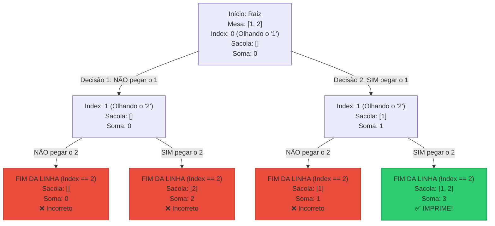

# 🧠 Documentação Técnica: Resolução do Subset Sum (Powerset) com Backtracking

Este documento serve como um guia detalhado para entender, construir e depurar o algoritmo de **Subset Sum** utilizando a técnica de **Backtracking**. O objetivo é encontrar todos os subconjuntos de um conjunto de números cuja soma seja exatamente igual a um valor alvo (*target*).

---

## 📌 1. Visão Geral em Alto Nível (A Analogia da Mesa e das Sacolas)

Imagine que você está sentado em uma sala de testes com três objetos à sua frente:

1. **A Mesa de Trabalho (`set`):** Onde estão espalhados todos os números que o usuário digitou no terminal (ex: `1, 2, 3`).
2. **A Folha de Papel (`current_sum`):** Onde você anota, a lápis, a soma atual de tudo o que coletou.
3. **A Sacola (`subset`):** Onde você guarda temporariamente os números escolhidos para o teste atual.

Você recebe uma missão do inspetor: **"Encontre as combinações de números que somam exatamente 3."**

### O Processo de Decisão Binária

Para cumprir a missão, você olha para cada número da mesa, um por um (controlado pelo `index`), e toma uma **decisão binária** (SIM ou NÃO):

* **Galho do NÃO (Ignorar):** Você decide deixar o número na mesa. Você não mexe na sacola, não altera a folha de papel da soma e simplesmente passa para o próximo número.
* **Galho do SIM (Incluir):** Você pega o número da mesa, coloca dentro da **Sacola**, adiciona o valor dele na sua **Folha de Papel** e passa para o próximo número.

Quando você chega ao final da mesa (não há mais números para olhar), você olha para a sua folha de papel.

* Se a soma for **exatamente 3**, você abre a sacola, grita o resultado (imprime na tela) e esvazia o último item da sacola para tentar outras combinações.
* Se não for, você apenas ignora, desfaz o último passo (**Backtrack**) e tenta o outro caminho.

---

## 🌲 2. A Árvore de Decisão (Diagrama Mermaid)

Cada chamada da função `backtrack` funciona como um nó em uma árvore binária de escolhas.

Considerando a entrada de mesa `[1, 2]` e o alvo `Target = 3`, veja como a árvore completa de possibilidades é construída pelo algoritmo:



---

## 💻 3. Arquitetura do Código e Fluxo de Dados

O programa divide-se estritamente em 3 blocos funcionais com responsabilidades isoladas:

### 🧱 Bloco 1: Formatação e Saída (`print_subset`)

Esta função cuida da burocracia de exibição exigida pelos corretores automáticos (evitar espaços em branco sobrando no final da linha).

* **Caso Especial (`size == 0`):** Se a sacola estiver vazia mas a soma for igual ao alvo (ocorre quando o target é `0`), o corretor exige uma linha em branco. O `return;` imediato impede que o programa continue e tente acessar índices inválidos.
* **Operador Ternário:** `(i == size - 1) ? "" : " "` garante que o espaço em branco seja impresso apenas **entre** os números, e nunca após o último.

### 🧠 Bloco 2: O Motor Recursivo (`backtrack`)

O coração do algoritmo. Ele recebe o estado atual do problema por parâmetros.

1. **Caso Base (Condição de Parada):** `if (index == set_size)`
Garante a segurança da memória da mesa. Se sairmos dos limites do array, testamos a soma. Se correta, imprimimos. Em seguida, damos `return;` para forçar o recuo da recursão.
2. **Caminho Esquerdo (Avanço sem alteração):** Executa a chamada passando `subset_size` e `current_sum` intactos.
3. **Caminho Direito (Aproviação de estado):** Sobrescreve o índice atual da sacola `subset[subset_size] = set[index]` e passa as variáveis incrementadas para a próxima chamada.

### 💼 Bloco 3: Validação e Alocação de Recursos (`main`)

Prepara o ambiente para o Backtracking rodar de forma segura.

* **Validação do Alvo `0`:** `argv[1][0] == '0' && argv[1][1] == '\0'` impede falsos positivos (como entradas `05` ou `00`) de encerrarem o programa incorretamente.
* **Cálculo da Mesa:** `set_size = argc - 2` ajusta o tamanho exato descontando o nome do executável e o argumento do alvo.
* **Segurança no Malloc:** Garante que se o segundo `malloc` falhar, o primeiro seja limpo imediatamente com `free(set)` antes de abortar o programa, mitigando riscos de *Memory Leak*.

---

## 📊 4. Exemplo Prático de Fluxo de Dados

Vamos rastrear o estado das variáveis na memória durante a execução do comando:

`./a.out 3 1 2`

### Passo 1: Inicialização na `main`

* `argc` = 3
* `target` = 3
* `set_size` = 3 - 2 = 1
* Memória Alocada: `set` (capacidade 1), `subset` (capacidade 1).
* Array da Mesa populado: `set[0] = 1`
* Disparo inicial: `backtrack(set, 1, 0, subset, 0, 0, 3);`

### Passo 2: Execução do Backtrack (Nó Raiz - `index = 0`)

* `index (0) == set_size (1)`? Não.
* **Decisão 1 (NÃO):** Chama `backtrack` avançando apenas o index:
`backtrack(set, 1, 1, subset, 0, 0, 3);`
* *Dentro da nova chamada:* `index (1) == set_size (1)`. Chegamos ao fim da linha!
* Verifica: `current_sum (0) == target (3)`? Não.
* Retorna (`return`), desfazendo a chamada e voltando para o nó raiz.


* **Decisão 2 (SIM):** De volta ao nó raiz, o programa executa a linha seguinte:
`subset[0] = set[0];` (Sacola agora contém `[1]`)
Chama `backtrack` incrementando o estado:
`backtrack(set, 1, 1, subset, 1, 1, 3);`
* *Dentro da nova chamada:* `index (1) == set_size (1)`. Fim da linha!
* Verifica: `current_sum (1) == target (3)`? Não.
* Retorna (`return`), a execução volta para a `main`.


### Passo 3: Finalização

* O fluxo volta para a `main`.
* `free(set);` e `free(subset);` limpam a memória perfeitamente.
* Programa encerra com `return 0`.

---

## 🛠️ 5. Código Completo Protegido para o Exame

```c
#include <stdio.h>
#include <stdlib.h>

/**
 * Imprime o subconjunto formatado de acordo com as regras da 42.
 */
void print_subset(int *subset, int size)
{
    if (size == 0)
    {
        printf("\n");
        return;
    }
    for (int i = 0; i < size; i++)
    {
        printf("%d%s", subset[i], (i == size - 1) ? "" : " ");
    }
    printf("\n");
}

/**
 * Motor de busca recursiva (Backtracking).
 */
void backtrack(int *set, int set_size, int index, int *subset, int subset_size, int current_sum, int target)
{
    // CASO BASE: Fim da árvore de decisão
    if (index == set_size)
    {
        if (current_sum == target)
        {
            print_subset(subset, subset_size);
        }
        return; // Trava de segurança para evitar estouro de memória
    }

    // DECISÃO 1: NÃO incluir o número atual
    backtrack(set, set_size, index + 1, subset, subset_size, current_sum, target);

    // DECISÃO 2: SIM, incluir o número atual
    subset[subset_size] = set[index]; // Sobrescreve a posição atual da sacola
    backtrack(set, set_size, index + 1, subset, subset_size + 1, current_sum + set[index], target);
}

/**
 * Validação de entrada e gerência de recursos principais.
 */
int main(int ac, char **av)
{
    // 1. Validação de argumentos mínimos
    if (ac < 2)
        return 1;

    // 2. Caso Limite: Alvo estrito igual a "0"
    if (av[1][0] == '0' && av[1][1] == '\0')
    {
        printf("\n");
        return 0;
    }

    int target = atoi(av[1]);
    int set_size = ac - 2;

    // 3. Validação de consistência do conjunto informado
    if (set_size <= 0)
        return 1;

    // 4. Alocação Dinâmica de Recursos (Heap)
    int *set = malloc(sizeof(int) * set_size);
    int *subset = malloc(sizeof(int) * set_size);

    // 5. Proteção contra falhas de alocação (Anti-Leak)
    if (!set || !subset)
    {
        free(set);
        free(subset);
        return 1;
    }

    // 6. Conversão do Input (Strings para Inteiros)
    for (int i = 0; i < set_size; i++)
    {
        set[i] = atoi(av[i + 2]);
    }

    // 7. Disparo do algoritmo
    backtrack(set, set_size, 0, subset, 0, 0, target);

    // 8. Desalocação obrigatória de recursos antes do término
    free(set);
    free(subset);
    return 0;
}

```

---

## 🎯 6. Dicas de Ouro para a Prova (GDB e Depuração)

* **O truque da Sobrescrita:** Lembre-se de que você **nunca** precisa apagar ou "limpar" dados do array `subset` quando a recursão volta. A linha `subset[subset_size] = set[index]` naturalmente reescreve o topo da sacola quando um novo caminho do "SIM" for testado. Quem dita o que é válido ou não é unicamente o `subset_size`.
* **Depurando no GDB:** Se o programa der *Segfault*, coloque um `breakpoint` na função `backtrack` e use o comando `backtrace` (ou `bt`) no terminal do GDB. Ele vai te mostrar exatamente qual a profundidade da árvore recursiva em que o ponteiro se perdeu, facilitando achar erros em condições `if (index == set_size)`.